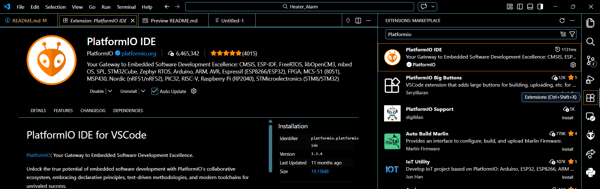

# Heater Alarm
A small and easy to mount device that turns on a heater in order to warm a room at a specified military time.


## Table of Contents
1. [Demo](#demo)
2. [Built With](#built-with)
3. [Installation](#installation)
4. [Getting Started](#getting-started)
5. [Usage](#usage)
6. [License](#license)
7. [Acknowledgments](#acknowledgments)


## Demo
A Youtube Short testing the Heater Alarm can be found here: <br>
[](https://youtube.com/shorts/zdMKMSuSnVs)

## Built With
IDE: VScode with Platformio extension<br>
MCU: ESP32 wroom wifi devkit V1<br>
Serial Monitoring: Tera Term<br>
Platform: Espressif32<br>
Framework: Adruino<br>

## Installation
* To clone this repository:

    ```bash
    git clone https://github.com/Carlosv7389/Heater_Alarm
    ```

* Download VScode at [this link](https://code.visualstudio.com/download)

    * In the "extension" section find platformio 
    <!--  -->
    

* Download Tera Term at [this link](https://github.com/TeraTermProject/teraterm/releases)
## Getting Started 
* In VScode, open the folder *Platformio_arduino_wifi*

* Build the circuit shown below:<br>
    


## Usage
Before pushing the code on to the microcontroller, select all code in *main.cpp* and comment it out. The code from the files in the *lib* folder will be pasted into the bottom of the main file and ran before running the actual main code. A basic runthrough uploading the code to the board can be found **here**. 

* Edit the file *include/secrets.h* to change the ssid and password to your wifi ssid and password.
    ```cpp
    // wifi credentials
    const char *ssid = "change to your SSID";
    const char *password = "change to your password";
    ```

* Check Wifi coverage for your microcontroller by running the code found in *lib/WiFi/WIFIScan.cpp*, run Tera Term and check to see if your WiFi SSID is found in the serial terminal ouput, in the image below, my SSID is CMCKV9803 and so the device is close enough.<br>


* Verify circuit by running the code found in *lib/Blink/Blink.cpp*. When the LED transitions from off to on, the heater should turn on as well as seen in the gif below <br>


* Deploy program by uncommenting the code and change the main file in order to match your target time, local timezone, and daylight savings offset.
```cpp
const long gmtOffset_sec = -21600;  // offset for Central Standard Time
const int daylightOffset_sec = 3600; // 1 hour in seconds added during daylight savings in the fall, otherwise set equal to 0.
const int TARGET_HOUR = 8;    // 8 hours
const int TARGET_MINUTE = 15;  // 15 minutes
const int TARGET_SECOND = 0;   // 0 seconds
```
## License
This project is licensed under the MIT License - see the [LICENSE](LICENSE) file for details.

## Acknowledgments
Huge thanks to the channel [Leo's Bag of Tricks](https://www.youtube.com/@leosbagoftricks3732) for making insightful videos on capacitive touch circuits. The circuit shown in the demo is a THT version of the SMD circuit found [here](https://www.youtube.com/watch?v=V0UkCcv2LmQ)

## FAQ
**Cover the upload issue with the esp32 board**

**Cover gibberish output in Tera Term**

**Cover the serial port issue with Tera Term**

**Cover how to make the electrode and wire**